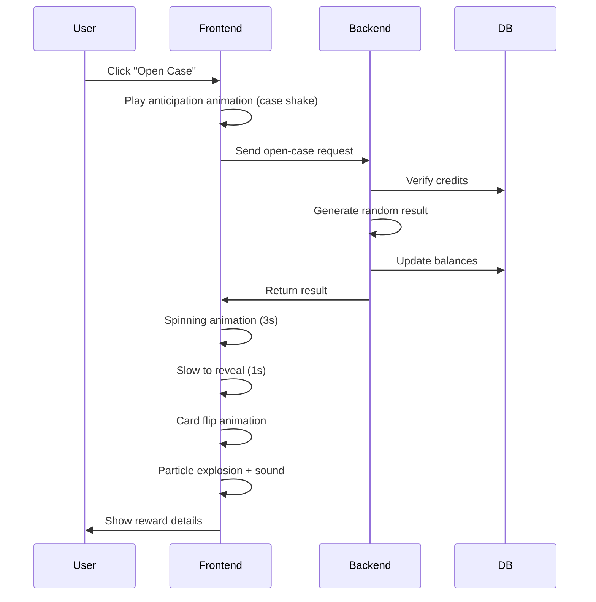

## 🚀 Final Unified Roadmap: From Functional to Professional

Based on both analyses, here's the consolidated, prioritized roadmap with timelines:

### 🔥 **Phase 1: Critical Fixes (1-2 Days)**
1. **Eliminate hardcoded case ID**
   - Create `/api/cases` endpoint
   - Fetch available cases dynamically in frontend
   - Update all components to use dynamic case data

2. **Implement robust error handling**
   - Add react-hot-toast for professional notifications
   - Create standardized error response format in API
   - Add error boundaries in React components

3. **Basic loading states**
   - Spinners for API calls
   - Skeleton screens for initial data loading
   - Disable buttons during operations

### 🛡️ **Phase 2: Security & Stability (3-5 Days)**
1. **Security hardening**
   ```typescript
   // Add rate limiting middleware
   import rateLimit from 'express-rate-limit';
   
   const caseLimiter = rateLimit({
     windowMs: 60 * 1000,
     max: 10,
     message: 'Too many requests, please wait'
   });
   
   // Apply to sensitive routes
   app.use('/api/open-case', caseLimiter);
   ```

2. **Fraud detection foundation**
   - Track case openings per user/hour
   - Monitor win/loss ratios
   - Flag suspicious activity patterns

3. **Database optimizations**
   - Add indexes on critical columns
   - Implement connection pooling
   - Set up regular backups

### 🎨 **Phase 3: UI/UX Revolution (1-2 Weeks)**
#### Animation System Upgrade
```typescript
// Install Framer Motion
npm install framer-motion

// Create multi-stage animation component
const CaseAnimation = () => {
  const [phase, setPhase] = useState('idle');
  
  const openCase = async () => {
    setPhase('anticipation');
    await sleep(300); // Build excitement
    
    setPhase('spinning');
    const result = await fetchResult();
    
    setPhase('revealing');
    await revealAnimation(result);
    
    setPhase('celebration');
    await celebrationEffects();
  };

  return (
    <>
      {phase === 'anticipation' && <ShakingAnimation />}
      {phase === 'spinning' && <SpinningWheel />}
      {phase === 'revealing' && <CardFlip result={result} />}
      {phase === 'celebration' && <ParticleExplosion />}
    </>
  );
};
```

#### Professional Design System
1. **Visual consistency**
   - Color palette for rarities (common=grey, legendary=gold)
   - Typography hierarchy
   - Spacing system (4px base)

2. **Feedback enhancements**
   - Hover animations on buttons
   - Pressed states
   - Micro-interactions

3. **Sound design**
   - SFX for case spinning
   - Reward reveal stings
   - Background ambiance

### 📱 **Phase 4: Mobile Excellence (3-5 Days)**
1. **Touch optimization**
   ```css
   /* Minimum touch target sizes */
   .case-button {
     min-width: 48px;
     min-height: 48px;
     padding: 12px 24px;
   }
   
   /* Mobile-first layout */
   .case-container {
     width: 90vw;
     max-width: 500px;
     aspect-ratio: 1;
   }
   ```

2. **Performance tuning**
   - Optimize image assets
   - Lazy load non-critical components
   - Implement virtualized lists

3. **PWA conversion**
   - Add manifest.json
   - Implement service worker
   - Enable install prompt

### 🧩 **Phase 5: Admin & Control (1 Week)**
**Admin Dashboard Features:**
```typescript
const AdminDashboard = () => {
  const [symbols, setSymbols] = useState([]);
  
  return (
    <div className="admin-panel">
      <SymbolEditor 
        symbols={symbols}
        onSave={updateSymbol}
      />
      
      <ProbabilityCurveEditor 
        rarities={rarities}
        onChange={updateProbabilities}
      />
      
      <RealTimeMonitor 
        openings={liveOpenings}
        users={activeUsers}
      />
    </div>
  );
};
```

1. **Symbol management**
   - CRUD operations for symbols
   - Bulk import/export
   - Preview generator

2. **Probability controls**
   - Visual probability curve editor
   - Drop rate simulator
   - A/B testing framework

3. **Analytics dashboard**
   - Real-time case opening monitor
   - Revenue tracking
   - Player retention metrics

### 🚀 **Phase 6: Advanced Features (2-3 Weeks)**
1. **3D integration**
   ```typescript
   // Three.js case model
   import { Canvas } from '@react-three/fiber';
   
   const Case3D = () => (
     <Canvas>
       <ambientLight intensity={0.5} />
       <CaseModel 
         position={[0, 0, 0]}
         rotation={[0, rotation, 0]}
       />
     </Canvas>
   );
   ```

2. **Social features**
   - Win sharing
   - Friend gifting
   - Leaderboards

3. **NFT integration**
   - Convert legendary items to NFTs
   - Marketplace integration
   - Blockchain verification

## 📊 Progress Assessment

### ✅ **What's Production-Ready Now**
1. **Core functionality**
   - Case opening mechanics
   - Credit system
   - Wallet integration
   - Basic database structure

2. **Foundation**
   - API endpoints
   - User management
   - Basic animations

### ⚠️ **What Needs Immediate Improvement**
1. **Flexibility**
   - Hardcoded IDs → Dynamic system
   - Manual DB edits → Admin dashboard

2. **Professional polish**
   - Clunky animations → Smooth sequences
   - Basic UI → Premium design system

3. **Security**
   - Add rate limiting
   - Implement fraud detection
   - Session management

### 📈 **Implementation Priority List**
1. **Week 1: Critical foundations**
   - Dynamic case loading
   - Error handling system
   - Basic admin panel

2. **Week 2-3: UX transformation**
   - Framer Motion animations
   - Sound design implementation
   - Mobile optimization

3. **Week 4: Security & performance**
   - Rate limiting
   - Database optimization
   - Asset preloading

4. **Month 2: Advanced features**
   - Three.js integration
   - Admin dashboard v2
   - NFT bridge

5. **Ongoing: Analytics & tuning**
   - A/B test probabilities
   - Monitor player behavior
   - Optimize economy balance

## 💎 Key Recommendations

### 1. Animation Performance Secrets
```typescript
// Use hardware-accelerated properties
const FastAnimation = styled.div`
  will-change: transform, opacity;
  transform: translateZ(0);
`;

// Optimize with React.memo
const MemoizedCard = React.memo(CardComponent);

// Preload assets
useEffect(() => {
  const preloadList = [
    '/gold-case.glb',
    '/sounds/win.mp3',
    ...symbols.map(s => s.imageUrl)
  ];
  preloadAssets(preloadList);
}, []);
```

### 2. Ultimate Case Opening Sequence


### 3. Professional Workflow
1. **Design first** - Create Figma prototypes for all animations
2. **Implement in stages** - Start with critical fixes, then enhance
3. **Test on target devices** - Especially mid-range mobile
4. **Measure performance** - Use Lighthouse, FPS monitors
5. **Iterate based on metrics** - Refine based on real user data

## 🏁 Final Checklist Before Launch

1. **Core Experience**
   - [ ] Smooth 60fps case opening animation
   - [ ] Dynamic case loading
   - [ ] Mobile-responsive layout

2. **Security**
   - [ ] Rate limiting implemented
   - [ ] Fraud detection baseline
   - [ ] Session management

3. **Admin Control**
   - [ ] Symbol management UI
   - [ ] Probability controls
   - [ ] Real-time monitoring

4. **Performance**
   - [ ] Asset preloading
   - [ ] Database indexes
   - [ ] Lazy loading

5. **Polish**
   - [ ] Sound effects
   - [ ] Haptic feedback
   - [ ] Error states

By following this roadmap, you'll transform your functional prototype into a professional, engaging experience that retains players and stands out in the competitive gaming market. The key is to prioritize animation smoothness and UI polish - these create the "wow factor" that keeps players coming back! 🚀